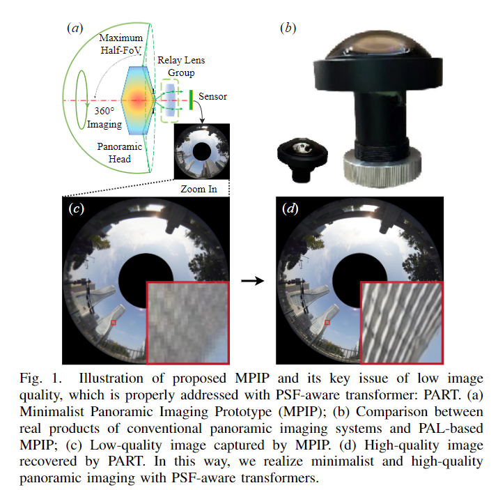
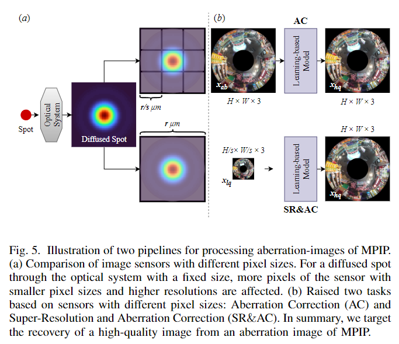
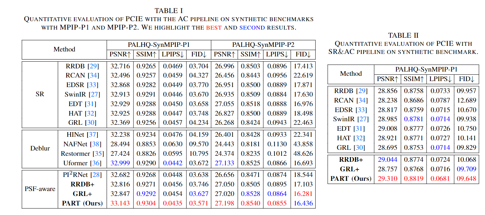
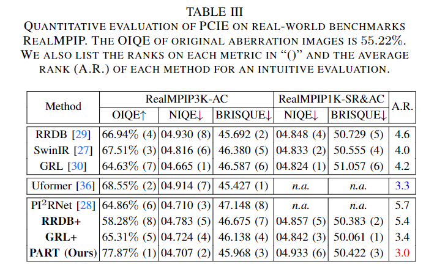

### PSF-aware Aberration-image Restoration Transformer (PART) for Panoramic Computational Imaging Engine (PCIE)
PART is desinged for recovering high-resolution and aberration-free panoramic images from low-quality images taken by minimalist panoramic imaging systems. 

The new dataset PALHQ and the codes of PART will be realeased soon.
> 
---
#### Qi Jiang, Shaohua Gao, Yao Gao, Kailun Yang, Zhonghua Yi, Hao Shi, Lei Sun and Kaiwei Wang
#### Paper (preprint): https://arxiv.org/pdf/2306.12992.pdf

### Introduction
<div align="center">

</div>      
This work focuses on attaining high-quality panoramic imaging with minimalist optical systems, where the degraded panoramic images by optical aberrations are processed by learning-based computational methods. We propose the Panoramic Computational Imaging Engine (PCIE) as a solution and conduct extensive experiments, which deliver instructive findings on achieving impressive panoramic imaging with a minimalist lens, in terms of optical design, sensor selection, network architecture, training strategies, and dataset construction. 
<div align="center">

</div>
Specifically, the Minimalist Panoramic Imaging Prototype (MPIP) based on the design of the Panoramic Annular Lens (PAL) is put forward as an optical baseline. We further explore the potential of engaging the Point Spread Function (PSF) in transformer-based image recovery models for recovering aberration images, designing the PSF-aware Aberration-image Recovery Transformer (PART) with plug-and-play PSF-aware mechanisms. The PSF-awre mechanisms improve the performance of several baseline models and the PART sets the state of the art. 
<div align="center">

</div>
We deliver 2 pipelines with different pixel sizes of senors to solve the issue, i.e., Aberration Correction (AC) and Super-resolution and Aberration Correction (SR&AC). 
<div align="center">

</div>
Moreover, we deliver a contribution of datasets, where the PALHQ dataset composed of high-quality panoramic annular images captured by PAL is provided.  To the best of our knowledge, PALHQ is the first dataset for investigating low-level vision with PAL images, which serves as the cornerstone of PAL-based image processing for providing high-quality ground truth. 
<div align="center">

</div>

### Results

---
PCIE enables minimalist and high-quality panoramic imaging, where PART and PSF-aware mechanisms deliver better performance. 
Synthetic dataset:
<div align="center">


</div>

Real dataset:
<div align="center">


</div>


### Citations

If PCIE-PART helps your research or work, please consider citing PCIE-PART.
```
@misc{jiang2023minimalist,
      title={Minimalist and High-Quality Panoramic Imaging with PSF-aware Transformers}, 
      author={Qi Jiang and Shaohua Gao and Yao Gao and Kailun Yang and Zhonghua Yi and Hao Shi and Lei Sun and Kaiwei Wang},
      year={2023},
      eprint={2306.12992},
      archivePrefix={arXiv},
      primaryClass={cs.CV}
}
```

### Contact
If you have any questions, please contact qijiang@zju.edu.cn.
